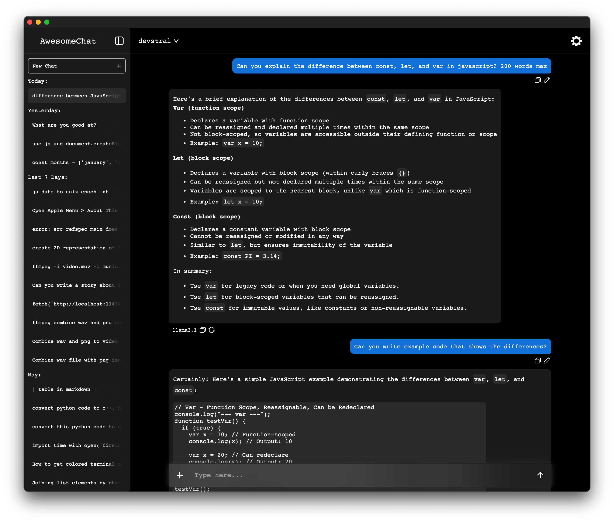

# AwesomeChat

Web UI for Ollama


**Note**: To send a message, press `Cmd+Enter` (`Ctrl+Enter` on Windows).

> [!WARNING]
> AwesomeChat is early in development and some features are still missing. Please report any bugs or issues that occur.

**Features**

AwesomeChat is a web interface to interact with AI models using Ollama. The following features are currently supported:

- **Saving Chats**: Conversations can be saved locally and loaded later
- **Copying Messages**: Copy user prompts and model outputs
- **Changing Models Mid-Conversation**: Switch between different models while chatting
- **Redoing Generations**: Re-generate text based on previous inputs
- **Editing Prompts**: Modify the input prompt for a model after generation
- **Switching Chats While Generating**: View a separate conversation while another one is still generating text
- **File Upload**: Send text files and images (vision supported models only) for processing
- **Chat Titles**: Automatically generated titles (currently uses smallest model available)
- **Automatic Updates**: AwesomeChat Will Automatically check for updates when opened (does not install updates without user input)
- **Settings**: A user interface to configure various options, such as theme and auto updates

**Known Bugs**

- Text selection is not possible when an AI is currently generating text

**Getting Started**

To run AwesomeChat:

1. Clone the repository

```
git clone https://github.com/Awesomefied/AwesomeChat
cd AwesomeChat
```

2. Install [Ollama](https://ollama.com/download)

> [!NOTE]
> Make sure you have at least one model downloaded through the terminal before starting AwesomeChat
> Example: `ollama pull qwen3:0.6b`
> Having a small model (less than 3b params) is recommended as it is used to generate titles

3. Install [Node JS](https://nodejs.org/en/download)

4. Run the start script

> Or run these commands:

```bash
# To make sure that Ollama is running
ollama list
# Installs required libraries (express, http-proxy)
npm install
# Runs the server
node server.js
```

# Linux / MacOS

```
./start.sh
```

# Windows

```
./start.bat
```

5. Open `http://127.0.0.1:3000` in your web browser

**Future Features**

The following features are planned but not yet implemented:

- **Custom Themes**: Users can select from a range of themes or create their own
- **Tool Calls**: Allow models to execute specific tools or functions within the chat interface
- **Code Blocks (Syntax Highlighting & Execution)**: Test and edit code written by AI directly from the chat interface.
- **HTML Viewer**: View and edit HTML content generated by models
- **Model Management**: Add, remove, and manage models
- **Enable/Disable Thinking**: Toggle thinking functionality for models that support it.
